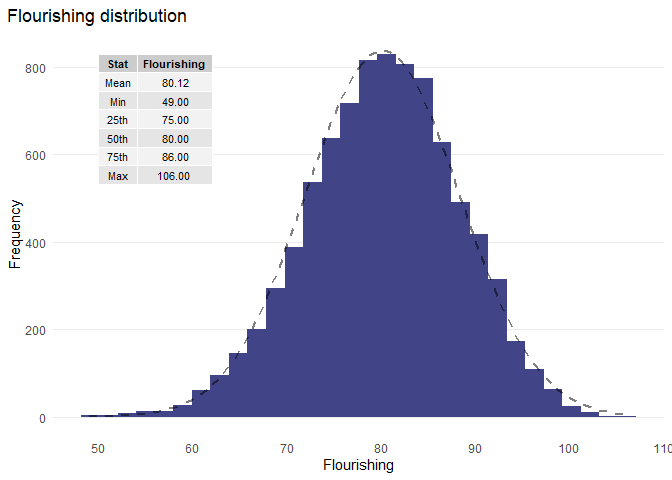
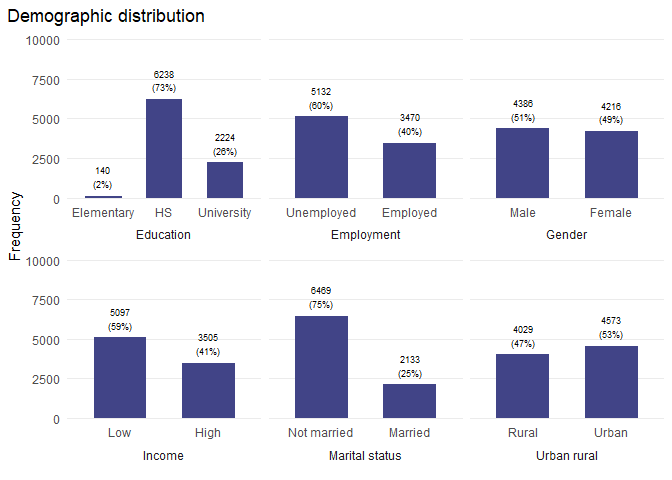
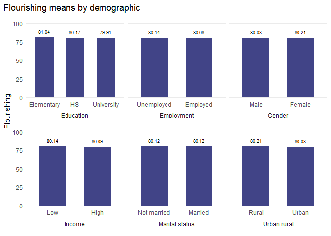
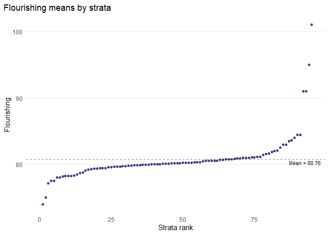
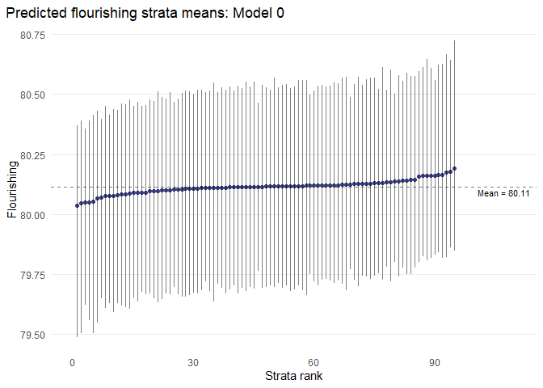

# Global Flourishing Study MAIHDA

Intersectionality is the study of how multiple sociodemographic
identities intersect and interact to create unique experiences of
discrimination and privilege that result in inequalities in individual
outcomes. Intersectionality makes visible the experiences of hidden
marginalized populations.

From quantitative data analysis perspective, a natural approach to study
intersectional sociodemographic inequalities in individual outcomes is
to estimate linear regressions of the individual outcome of interest on
their sociodemographic characteristics and their interactions. As we
introduce further sociodemographic characteristics, it proves
statistically and interpretationally challenging to also introduce more
and more interactions, many imprecisely estimated parameters and risk of
type I errors. As a result, interactions effects and therefore
intersectionality in individual outcomes is typically under explored,
running the risk of misunderstanding or even missing important
marginalized populations.

Intersectional Multilevel Analysis of Individual Heterogeneity and
Discriminatory Accuracy (MAIHDA) aims to address these challenges, a
systematic approach to explore many and complex interaction effects.
Intersectional MAIHDA involves an innovative application of two-level
linear regression of individual outcomes where individuals are modeled
as clustered in 10s or even 100s of strata defined by the combinations
of their sociodemographics characteristics, interest lies in studying
how mean outcomes vary across strata. The approach was proposed by Evans
et al. (2018) and has been further developed by Evans, Merlo, Leckie,
and others.

## Data

Data were drawn from Global Flourishing Study in Sweden. Sample consists
of 8602 respondents after being cleaned. The outcome is flourishing
score. The sociodemographic characteristics are: income, education,
employment, gender, marital status, urban/rural.

|                |             | Mean | Std. Dev. |
|----------------|-------------|------|-----------|
| Flourishing    |             | 80.1 | 8.2       |
|                |             | N    | Pct.      |
| Income         | High        | 3505 | 40.7      |
|                | Low         | 5097 | 59.3      |
| Education      | University  | 2224 | 25.9      |
|                | High school | 6238 | 72.5      |
|                | Elementary  | 140  | 1.6       |
| Employment     | Employed    | 3470 | 40.3      |
|                | Unemployed  | 5132 | 59.7      |
| Gender         | Female      | 4216 | 49.0      |
|                | Male        | 4386 | 51.0      |
| Marital status | Married     | 2133 | 24.8      |
|                | Not married | 6469 | 75.2      |
| Urban/rural    | Urban       | 4573 | 53.2      |
|                | Rural       | 4029 | 46.8      |

## Strata

The strata is defined by combination of income, education, employment,
gender, marital status and urban/rural, resulting in 200 theoretical
strata. The individual flourishing score are now viewed as clustered in
strata, the variables defining the strata are elevated from individual
to stratum level characteristics. Intersectional strata identities and
even the characteristics defining them are no longer modeled as personal
characteristics (risking “blaming the victim”), but are now modeled as
social contexts viewed as encompassing the broader shared social
experiences of individuals in each strata.

## Model fit

Model null measures the extent to which individual outcome heterogeneity
is explained by sociodemographic intersections vs other factors.
Optimally predicts the mean outcome for each stratum.

Model full decomposes sociodemographic mean outcomes into additive and
non-additive effects and measures relative importance of interactions.
Optimally predicts the strata interaction effects with built in control
for type I errors of inference.

Model is fitted by maximum likelihood estimation (MLE).

<table style="border-collapse:collapse; border:none;">
<tr>
<th style="border-top: double; text-align:center; font-style:normal; font-weight:bold; padding:0.2cm;  text-align:left; ">&nbsp;</th>
<th colspan="2" style="border-top: double; text-align:center; font-style:normal; font-weight:bold; padding:0.2cm; ">Mental health</th>
<th colspan="2" style="border-top: double; text-align:center; font-style:normal; font-weight:bold; padding:0.2cm; ">Mental health</th>
</tr>
<tr>
<td style=" text-align:center; border-bottom:1px solid; font-style:italic; font-weight:normal;  text-align:left; ">Predictors</td>
<td style=" text-align:center; border-bottom:1px solid; font-style:italic; font-weight:normal;  ">Estimates</td>
<td style=" text-align:center; border-bottom:1px solid; font-style:italic; font-weight:normal;  ">CI (95%)</td>
<td style=" text-align:center; border-bottom:1px solid; font-style:italic; font-weight:normal;  ">Estimates</td>
<td style=" text-align:center; border-bottom:1px solid; font-style:italic; font-weight:normal;  ">CI (95%)</td>
</tr>
<tr>
<td style=" padding:0.2cm; text-align:left; vertical-align:top; text-align:left; ">Intercept</td>
<td style=" padding:0.2cm; text-align:left; vertical-align:top; text-align:center;  ">80.12</td>
<td style=" padding:0.2cm; text-align:left; vertical-align:top; text-align:center;  ">79.93&nbsp;&ndash;&nbsp;80.29</td>
<td style=" padding:0.2cm; text-align:left; vertical-align:top; text-align:center;  ">81.11</td>
<td style=" padding:0.2cm; text-align:left; vertical-align:top; text-align:center;  ">79.68&nbsp;&ndash;&nbsp;82.51</td>
</tr>
<tr>
<td style=" padding:0.2cm; text-align:left; vertical-align:top; text-align:left; ">Income: High</td>
<td style=" padding:0.2cm; text-align:left; vertical-align:top; text-align:center;  "></td>
<td style=" padding:0.2cm; text-align:left; vertical-align:top; text-align:center;  "></td>
<td style=" padding:0.2cm; text-align:left; vertical-align:top; text-align:center;  ">&#45;0.04</td>
<td style=" padding:0.2cm; text-align:left; vertical-align:top; text-align:center;  ">&#45;0.40&nbsp;&ndash;&nbsp;0.34</td>
</tr>
<tr>
<td style=" padding:0.2cm; text-align:left; vertical-align:top; text-align:left; ">Education: High school</td>
<td style=" padding:0.2cm; text-align:left; vertical-align:top; text-align:center;  "></td>
<td style=" padding:0.2cm; text-align:left; vertical-align:top; text-align:center;  "></td>
<td style=" padding:0.2cm; text-align:left; vertical-align:top; text-align:center;  ">&#45;0.88</td>
<td style=" padding:0.2cm; text-align:left; vertical-align:top; text-align:center;  ">&#45;2.27&nbsp;&ndash;&nbsp;0.54</td>
</tr>
<tr>
<td style=" padding:0.2cm; text-align:left; vertical-align:top; text-align:left; ">Education: University</td>
<td style=" padding:0.2cm; text-align:left; vertical-align:top; text-align:center;  "></td>
<td style=" padding:0.2cm; text-align:left; vertical-align:top; text-align:center;  "></td>
<td style=" padding:0.2cm; text-align:left; vertical-align:top; text-align:center;  ">&#45;1.14</td>
<td style=" padding:0.2cm; text-align:left; vertical-align:top; text-align:center;  ">&#45;2.54&nbsp;&ndash;&nbsp;0.25</td>
</tr>
<tr>
<td style=" padding:0.2cm; text-align:left; vertical-align:top; text-align:left; ">Employed</td>
<td style=" padding:0.2cm; text-align:left; vertical-align:top; text-align:center;  "></td>
<td style=" padding:0.2cm; text-align:left; vertical-align:top; text-align:center;  "></td>
<td style=" padding:0.2cm; text-align:left; vertical-align:top; text-align:center;  ">&#45;0.07</td>
<td style=" padding:0.2cm; text-align:left; vertical-align:top; text-align:center;  ">&#45;0.44&nbsp;&ndash;&nbsp;0.31</td>
</tr>
<tr>
<td style=" padding:0.2cm; text-align:left; vertical-align:top; text-align:left; ">Gender: Female</td>
<td style=" padding:0.2cm; text-align:left; vertical-align:top; text-align:center;  "></td>
<td style=" padding:0.2cm; text-align:left; vertical-align:top; text-align:center;  "></td>
<td style=" padding:0.2cm; text-align:left; vertical-align:top; text-align:center;  ">0.18</td>
<td style=" padding:0.2cm; text-align:left; vertical-align:top; text-align:center;  ">&#45;0.19&nbsp;&ndash;&nbsp;0.56</td>
</tr>
<tr>
<td style=" padding:0.2cm; text-align:left; vertical-align:top; text-align:left; ">Married</td>
<td style=" padding:0.2cm; text-align:left; vertical-align:top; text-align:center;  "></td>
<td style=" padding:0.2cm; text-align:left; vertical-align:top; text-align:center;  "></td>
<td style=" padding:0.2cm; text-align:left; vertical-align:top; text-align:center;  ">0.01</td>
<td style=" padding:0.2cm; text-align:left; vertical-align:top; text-align:center;  ">&#45;0.40&nbsp;&ndash;&nbsp;0.42</td>
</tr>
<tr>
<td style=" padding:0.2cm; text-align:left; vertical-align:top; text-align:left; ">Urban</td>
<td style=" padding:0.2cm; text-align:left; vertical-align:top; text-align:center;  "></td>
<td style=" padding:0.2cm; text-align:left; vertical-align:top; text-align:center;  "></td>
<td style=" padding:0.2cm; text-align:left; vertical-align:top; text-align:center;  ">&#45;0.17</td>
<td style=" padding:0.2cm; text-align:left; vertical-align:top; text-align:center;  ">&#45;0.56&nbsp;&ndash;&nbsp;0.20</td>
</tr>
<tr>
<td colspan="5" style="font-weight:bold; text-align:left; padding-top:.8em;">Random Effects</td>
</tr>
&#10;<tr>
<td style=" padding:0.2cm; text-align:left; vertical-align:top; text-align:left; padding-top:0.1cm; padding-bottom:0.1cm;">&sigma;2</td>
<td style=" padding:0.2cm; text-align:left; vertical-align:top; padding-top:0.1cm; padding-bottom:0.1cm; text-align:left;" colspan="2">70.42</td>
<td style=" padding:0.2cm; text-align:left; vertical-align:top; padding-top:0.1cm; padding-bottom:0.1cm; text-align:left;" colspan="2">67.85</td>
</tr>
&#10;<tr>
<td style=" padding:0.2cm; text-align:left; vertical-align:top; text-align:left; padding-top:0.1cm; padding-bottom:0.1cm;">&tau;00</td>
<td style=" padding:0.2cm; text-align:left; vertical-align:top; padding-top:0.1cm; padding-bottom:0.1cm; text-align:left;" colspan="2">0.02 strata</td>
<td style=" padding:0.2cm; text-align:left; vertical-align:top; padding-top:0.1cm; padding-bottom:0.1cm; text-align:left;" colspan="2">0.03 strata</td>
&#10;<tr>
<td style=" padding:0.2cm; text-align:left; vertical-align:top; text-align:left; padding-top:0.1cm; padding-bottom:0.1cm;">ICC</td>
<td style=" padding:0.2cm; text-align:left; vertical-align:top; padding-top:0.1cm; padding-bottom:0.1cm; text-align:left;" colspan="2">0.00</td>
<td style=" padding:0.2cm; text-align:left; vertical-align:top; padding-top:0.1cm; padding-bottom:0.1cm; text-align:left;" colspan="2">0.00</td>
&#10;<tr>
<td style=" padding:0.2cm; text-align:left; vertical-align:top; text-align:left; padding-top:0.1cm; padding-bottom:0.1cm;">N</td>
<td style=" padding:0.2cm; text-align:left; vertical-align:top; padding-top:0.1cm; padding-bottom:0.1cm; text-align:left;" colspan="2">95 strata</td>
<td style=" padding:0.2cm; text-align:left; vertical-align:top; padding-top:0.1cm; padding-bottom:0.1cm; text-align:left;" colspan="2">95 strata</td>
<tr>
<td style=" padding:0.2cm; text-align:left; vertical-align:top; text-align:left; padding-top:0.1cm; padding-bottom:0.1cm; border-top:1px solid;">Observations</td>
<td style=" padding:0.2cm; text-align:left; vertical-align:top; padding-top:0.1cm; padding-bottom:0.1cm; text-align:left; border-top:1px solid;" colspan="2">8602</td>
<td style=" padding:0.2cm; text-align:left; vertical-align:top; padding-top:0.1cm; padding-bottom:0.1cm; text-align:left; border-top:1px solid;" colspan="2">8602</td>
</tr>
<tr>
<td style=" padding:0.2cm; text-align:left; vertical-align:top; text-align:left; padding-top:0.1cm; padding-bottom:0.1cm;">Marginal R2 / Conditional R2</td>
<td style=" padding:0.2cm; text-align:left; vertical-align:top; padding-top:0.1cm; padding-bottom:0.1cm; text-align:left;" colspan="2">0.000 / 0.000</td>
<td style=" padding:0.2cm; text-align:left; vertical-align:top; padding-top:0.1cm; padding-bottom:0.1cm; text-align:left;" colspan="2">0.001 / 0.002</td>
</tr>
&#10;</table>

| Measure | Value   |
|---------|---------|
| VPC     | 0.03%   |
| VPC adj | 0.04%   |
| PCV     | -33.08% |

Variance partition coefficient (VPC) measures the proportion of
individual heterogeneity which lies between strata. The variance in
individual flourishing is 0.02% between strata means. There is less
variation between strata means, than within strata. Therefore, the
strata has very low discriminatory accuracy. The strata tells us very
little about individual toothache.

The VPC adjusted is just 0.03% which is too little for interaction
effects to explain the variation.

Percentage change in variance (PCV) measures the degree to which we
explain the overall sociodemographic variation by just the main effects.
The variation of sociodemographic main effects is -21.67%.

The caterpillar plot gives a sense of not just the variablity in
predicted strata means, but their individual imprecision, and their lack
of statistical separation.
